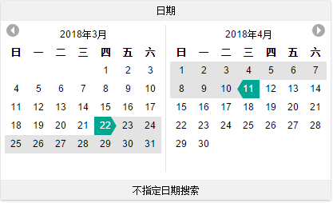
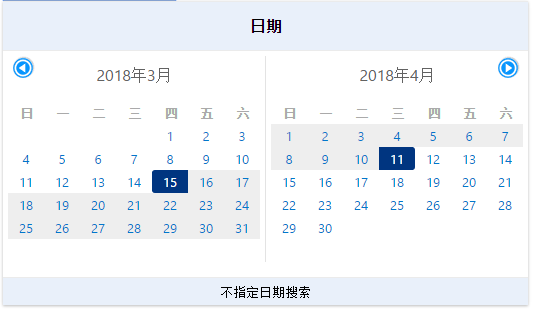
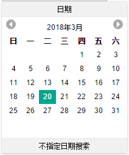
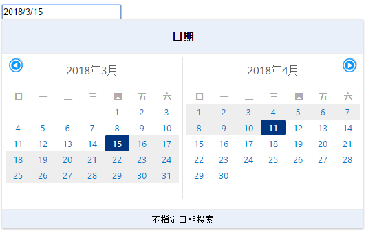
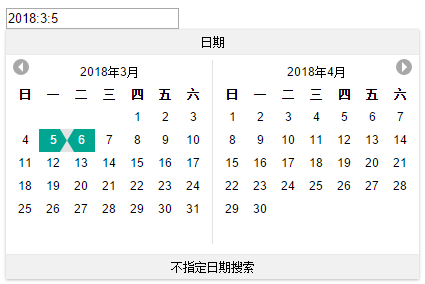

  datePick is a jquery plugin for date picker.this help user to input correct format date quickly.

## Usage
```
  <!DOCTYPE html>
  <html>
  <head>
    <meta charset="utf-8">
    <title>dataPicker示例</title>
    <link rel="stylesheet" href="./datePicker.css" media="all">
    <script src="./jquery.min.js"></script> 
    <script src="./datePicker.jq.min.js"></script> 
    <script src="./datePicker.jq.min.js.map"></script> 
  </head>
  <body>
    <input id="el" type="text" class="layui-input" id="test1"> 
    <script>
      $.dataPicker($('#el'));
    </script>
  </body>
  </html>
```
  $.dataPicker(el,options);


  |parameter|describtion|
  |:---------|:-----------|
  |el   |the input element that datePicker relative to|
  |options|a javascript object which contain some configuration for datePicker initial|

## options

  |option name|value type|value-describtion|
  |:---------|:-----------|:-----------|
  |lang   |string |"cn" chinese version;"en" english version|
  |theme |string|theme style ,value canbe "tripadvisor" (www.tripadvisor.com)or "booking"(www.booking.com)| 
  |range|bool|true for default.when false the selection type is not for range|  

  
tripadvisor theme

  
booking theme

  
range which is false

 ## interface
  the date format that picked is like Year/Month/date by default. but we also provide the interface for U to
 custom made the output date format.internal we trigger a "onchange" event which contain the date information that
 selected.So u just need to listen "onchange" event for the input element that datePicker relative to.
 here is an example:

```
		$.dataPicker($('#el'));
		$("#el").on("change",function(e,data0,data1){
			$(this).prop("value",data0.year+":"+(data0.month+1)+":"+data0.date);
		})
```
  > `data0` is the date start that selected for a date range
  > `data1` is the date end that selected for a date range
  > the format of `data0` and `data1` is like {year:2018,month:2,date:13},mpnth is 0~11 same as parameter for new Date()
  >

  
default output date format

  
custom made output date format